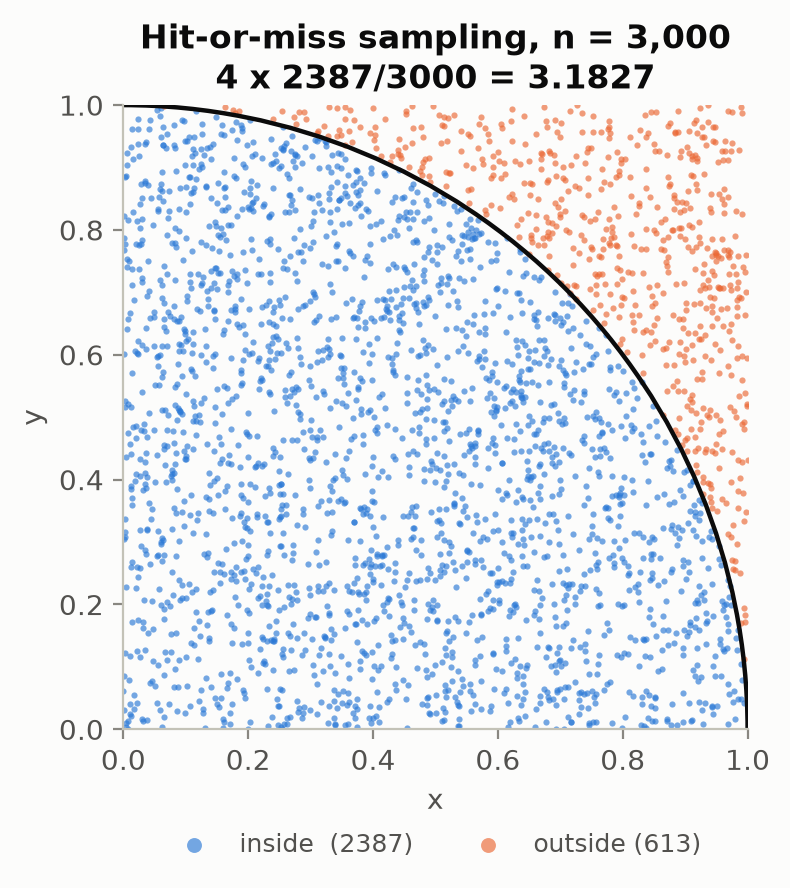
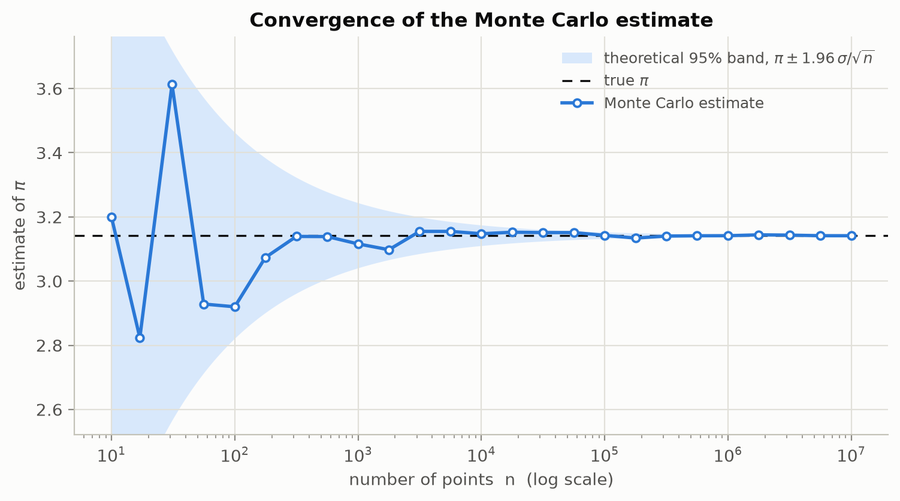
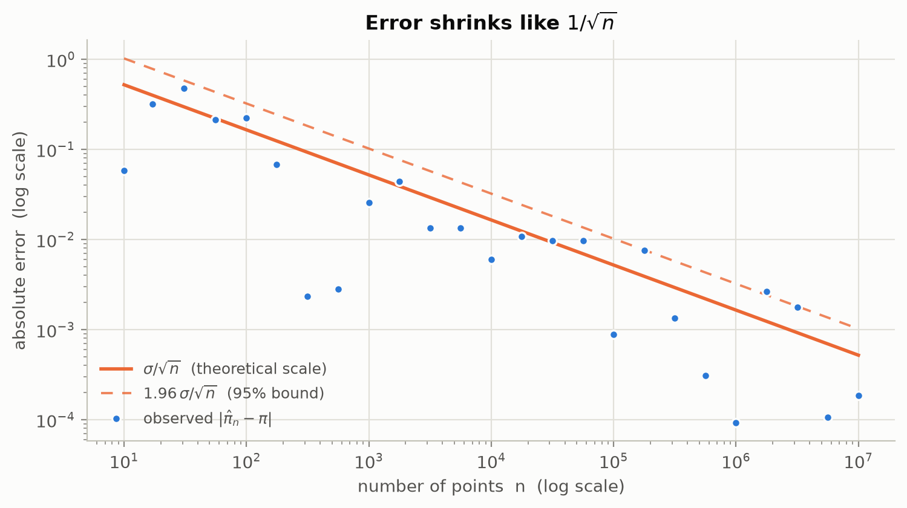
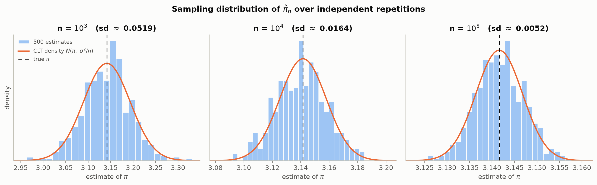
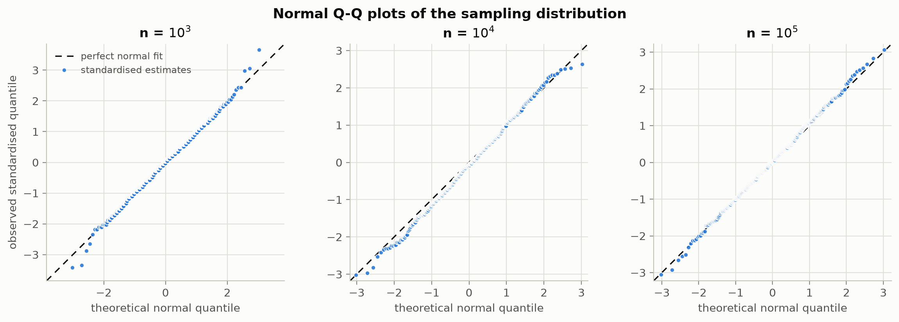

# Estimating π with Monte Carlo & the Central Limit Theorem

Course assignment — **PhD Artificial Intelligence**, Matin Esmaeili.

Estimate π by throwing random darts at a square, watch the error shrink like
`1/√n`, and show empirically that the estimator's sampling distribution is
Normal, exactly as the Central Limit Theorem predicts.

Everything — figures, data files and the PDF report — is produced by a single
reproducible script:

```bash
python esmaeili_matin_pi.py
```

---

## 1. The idea in one picture

Draw points uniformly in the unit square `[0,1]²`. A point is a *hit* when
`x² + y² ≤ 1`, i.e. when it lands inside the quarter disc of radius 1.

| region | area |
| --- | --- |
| unit square | `1` |
| quarter disc | `π/4` |

So the probability of a hit is `π/4`, and

```
π̂ₙ = 4 × (hits / n)
```



## 2. What the theory says

Let `I = 1{X² + Y² ≤ 1}`. Then `I ~ Bernoulli(p)` with `p = π/4`.

* **Unbiased:** `E[π̂ₙ] = 4p = π` for every `n`.
* **Variance:** `Var(4I) = 16 p(1−p) = π(4−π)`, therefore

  ```
  Var(π̂ₙ) = π(4−π)/n        sd(π̂ₙ) = √(π(4−π)) / √n ≈ 1.6422 / √n
  ```

* **Central Limit Theorem:** `π̂ₙ` is an average of `n` i.i.d. bounded terms, so

  ```
  π̂ₙ  ≈  Normal( π , π(4−π)/n )
  ```

Two testable consequences, and the script tests both:

1. The error decays like `1/√n` — one extra correct decimal digit costs **100×**
   more samples.
2. At fixed `n`, repeating the whole experiment many times produces a bell curve
   centred at π whose width is `1.6422/√n` — *predicted, not fitted*.

## 3. Results

### Convergence with n (Task 2)

One independent estimate at each of 25 sample sizes from `10` to `10⁷`. The
shaded band is the theoretical 95% envelope `π ± 1.96·σ/√n` — the estimates fall
inside it about 95% of the time, which is the point.



On log-log axes the absolute error tracks the `σ/√n` line with slope `−1/2`:



| n | estimate | absolute error | sd = 1.6422/√n |
| ---: | ---: | ---: | ---: |
| 10 | 3.20000 | 0.05841 | 0.51930 |
| 100 | 2.92000 | 0.22159 | 0.16422 |
| 1,000 | 3.11600 | 0.02559 | 0.05193 |
| 10,000 | 3.14760 | 0.00601 | 0.01642 |
| 100,000 | 3.14248 | 0.00089 | 0.00519 |
| 1,000,000 | 3.14150 | 0.00009 | 0.00164 |
| 10,000,000 | 3.14141 | 0.00018 | 0.00052 |

*(seed 20260914; full table in `results/convergence.csv`)*

### Sampling distribution at fixed n (Task 3)

For `n ∈ {10³, 10⁴, 10⁵}` the entire experiment is repeated **R = 500** times.
The orange curve is the CLT density `N(π, π(4−π)/n)` — an overlay of the
prediction, with nothing fitted to the histogram.



| n | mean | bias | empirical sd | CLT sd | ratio | skew | excess kurt. | KS | 95% coverage |
| ---: | ---: | ---: | ---: | ---: | ---: | ---: | ---: | ---: | ---: |
| 1,000 | 3.14126 | −0.00034 | 0.05242 | 0.05193 | 1.009 | −0.032 | +0.397 | 0.028 | 0.948 |
| 10,000 | 3.14033 | −0.00127 | 0.01749 | 0.01642 | 1.065 | +0.005 | −0.245 | 0.056 | 0.924 |
| 100,000 | 3.14176 | +0.00017 | 0.00534 | 0.00519 | 1.028 | +0.018 | −0.063 | 0.035 | 0.946 |

Reading the table:

* **bias ≈ 0** at every `n` — the estimator is unbiased.
* **ratio ≈ 1** — the observed spread matches `√(π(4−π)/n)` to a few percent.
* **skew ≈ 0, excess kurtosis ≈ 0** — the shape is Gaussian.
* **KS** is the Kolmogorov–Smirnov distance to the *exact* CLT limit (parameters
  not estimated from the data), so the classical 5% critical value
  `1.36/√500 = 0.061` applies. Every value is below it.
* **95% coverage** — the fraction of replicates whose 95% confidence interval
  actually contains π. All near the nominal 0.95.

The normal Q-Q plots say the same thing geometrically: points on the diagonal
mean normal.



Worth noticing: the underlying draws are **Bernoulli** — about as far from
normal as a random variable gets — yet their average is already
indistinguishable from Gaussian at `n = 1000`. Normality is a property of the
*average*, not of the data.

---

## 4. The code

Single file: [`esmaeili_matin_pi.py`](esmaeili_matin_pi.py). No dependencies
beyond NumPy and matplotlib (statistics come from NumPy plus the standard
library's `statistics.NormalDist`).

### The estimator (Task 1)

```python
def estimate_pi(n, rng=None):
    """Monte Carlo estimate of pi from n random points in the unit square."""
    rng = np.random.default_rng() if rng is None else rng
    return 4.0 * count_inside(int(n), rng) / int(n)
```

`count_inside` generates points in **blocks of 1,000,000** and tests each block
with one vectorised NumPy comparison. Two reasons: no Python-level loop over
points, and peak memory stays around 16 MB whether `n` is 10³ or 10⁷.

### Module map

| Function / class | Role |
| --- | --- |
| `estimate_pi(n, rng)` | **Task 1** — the estimator required by the assignment |
| `count_inside(n, rng)` | Chunked, vectorised hit counting |
| `standard_error(n)` | Theoretical `√(π(4−π)/n)` |
| `convergence_study(ns, rng)` | **Task 2** — one estimate per sample size |
| `sampling_study(n, R, rng)` | **Task 3** — R independent repetitions at fixed `n` |
| `SamplingResult.summary()` | Empirical moments vs. CLT predictions |
| `skewness`, `excess_kurtosis` | Shape diagnostics |
| `ks_statistic(x, mu, sigma)` | KS distance to the theoretical normal |
| `ci_coverage(est, n)` | Fraction of 95% CIs that contain π |
| `figure_*` | The five figures |
| `TextPage`, `build_report` | Flowing-text PDF report writer |
| `write_*` | CSV / JSON exports |

### Reproducibility

Every random draw comes from one seeded `numpy.random.default_rng(seed)`
instance threaded through the whole run, so `--seed 20260914` reproduces every
number and figure in this README byte for byte.

### Command line

```bash
python esmaeili_matin_pi.py                      # full run (~7 s)
python esmaeili_matin_pi.py --quick              # smaller n and R, for a fast check
python esmaeili_matin_pi.py --seed 7             # a different reproducible stream
python esmaeili_matin_pi.py -R 2000              # more repetitions per n
python esmaeili_matin_pi.py --sample-sizes 1000 10000 100000 1000000
python esmaeili_matin_pi.py --max-exp 8          # convergence study up to n = 10^8
python esmaeili_matin_pi.py --no-report          # figures and data only
python esmaeili_matin_pi.py --outdir out/        # write somewhere else
```

## 5. Running it

```bash
python -m venv .venv
source .venv/bin/activate        # Windows: .venv\Scripts\activate
pip install -r requirements.txt
python esmaeili_matin_pi.py
```

Tested with Python 3.14, NumPy 2.5.3, matplotlib 3.11.2. Runtime ≈ 7 s
(≈ 8 × 10⁷ sampled points in total).

## 6. Repository layout

```
esmaeili_matin_pi.py        the program (submitted file)
esmaeili_matin_report.pdf   generated report: theory, tables, all five figures
requirements.txt
figures/                    fig1 … fig5, PNG at 200 dpi
results/
  convergence.csv           n, estimate, absolute error, theoretical sd
  sampling_distribution.csv every individual replicate (n, replicate, estimate)
  summary.json              run metadata + all summary statistics
```

Both generated outputs are committed so the results can be read without running
anything; re-running with the default seed regenerates them identically.
